# TSRN Architecture Deep Dive
## Tropical Sheaf Renormalization Network — Complete Technical Reference

*Version: Research v2.0 (with Tropical Optimizers)*

---

## Table of Contents

1. [Executive Summary](#1-executive-summary)
2. [Architecture Overview](#2-architecture-overview)
3. [Component 1: Rotary Position Embeddings (RoPE)](#3-rope)
4. [Component 2: ALiBi — Attention with Linear Biases](#4-alibi)
5. [Component 3: Tropical Sparse Attention](#5-tropical-attention)
6. [Component 4: Sheaf Diffusion (Local Coherence)](#6-sheaf-diffusion)
7. [Component 5: Clifford Geometric FFN with SwiGLU](#7-clifford-ffn)
8. [Component 6: RG Coarse-Graining (Renormalization)](#8-rg-pool)
9. [Component 7: p-adic Hierarchical Memory](#9-padic-memory)
10. [Component 8: GRU-Gated Echo State Reservoir](#10-reservoir)
11. [Component 9: p-adic Attention](#11-padic-attention)
12. [Component 10: Tropical SSM (Max-Plus Recurrence)](#12-tropical-ssm)
13. [Component 11: Persistent Cross-Window Memory](#13-cross-window)
14. [Component 12: Learnable Gated Fusion](#14-gated-fusion)
15. [Gist Subsystem (tsrn_gist.py)](#15-gist-subsystem)
16. [Tropical Optimization Phases](#16-tropical-optimizers)
17. [Causality Analysis](#17-causality)
18. [Data Flow Diagrams](#18-data-flow)
19. [Geometric Interpretations](#19-geometry)
20. [Training Configuration](#20-training)
21. [References & Learning Resources](#21-references)

---

## 1. Executive Summary

TSRN is a **multi-scale autoregressive language model** that fuses five mathematical
frameworks into a single architecture:

| Framework | Module(s) | Purpose |
|-----------|-----------|---------|
| **Tropical Geometry** | TropicalAttention, TropicalSSM | Sparse routing via max-plus algebra |
| **Sheaf Theory** | SheafDiffusion, SheafRotorDiffusion | Local coherence via restriction maps |
| **Clifford Algebra** | CliffordFFN, CliffordRotor, GistRotation | Geometric feature transforms |
| **p-adic Analysis** | PAdicMemory, PAdicAttention | Hierarchical / ultrametric memory |
| **Renormalization Group** | RGPool, two-scale processing | Multi-resolution abstraction |

Additionally, the model now incorporates:
- **RoPE** and **ALiBi** for hybrid positional encoding
- **SwiGLU** gating in the feed-forward network
- **GRU-gated reservoir** for selective temporal memory
- **Tropical SSM** for max-plus state-space modeling
- **Learnable gated fusion** replacing hard-coded scale blending
- **6-phase tropical optimizer** for geometry-aware training

The total parameter count ranges from ~2M (quick) to ~50M (production).

### How the Five Geometric Spaces Connect

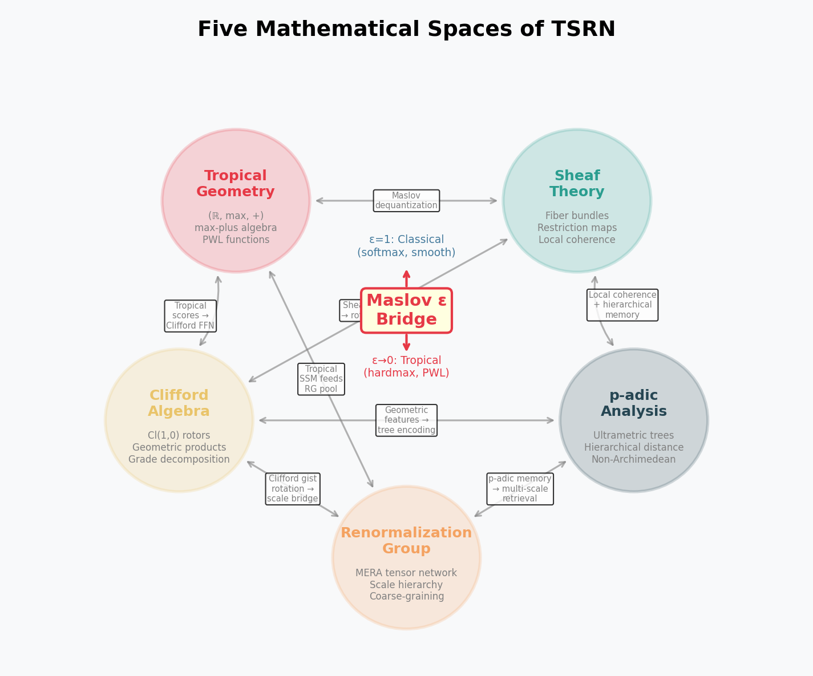
*Figure 0: The five mathematical frameworks and how they interrelate through the Maslov dequantization bridge.*

---

## 2. Architecture Overview

### Full Architecture Diagram

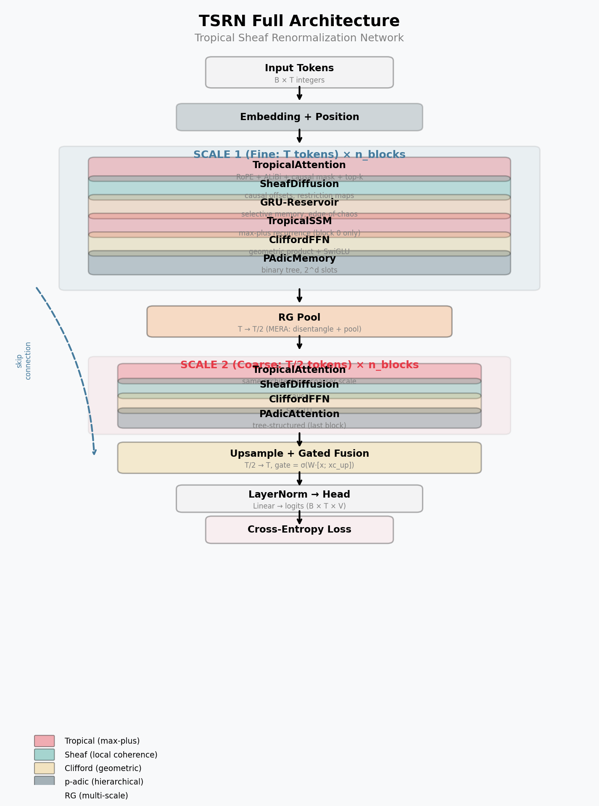
*Figure 1: Complete TSRN architecture showing Scale 1 (fine), RG Pool, Scale 2 (coarse), and gated fusion. Components are color-coded by mathematical framework.*

```
Input tokens: [x_0, x_1, ..., x_{T-1}]
        │
        ▼
  ┌─────────────┐
  │  Embedding   │  + Positional Embeddings (Scale 1)
  └──────┬──────┘
         │
  ┌──────▼──────────────────────────────────────────┐
  │              SCALE 1 (Fine: T tokens)            │
  │                                                  │
  │  ┌──────────────────────────────────────────┐   │
  │  │ TSRNBlock × n_blocks                      │   │
  │  │                                           │   │
  │  │  LayerNorm → TropicalAttention (RoPE+ALiBi)  │
  │  │      ↓ + residual                         │   │
  │  │  LayerNorm → SheafDiffusion (causal)      │   │
  │  │      ↓ + residual                         │   │
  │  │  [LayerNorm → GRU-EchoStateReservoir]     │   │
  │  │      ↓ + residual                         │   │
  │  │  [LayerNorm → TropicalSSM]                │   │
  │  │      ↓ + residual                         │   │
  │  │  LayerNorm → CliffordFFN (SwiGLU)         │   │
  │  │      ↓ + residual                         │   │
  │  │  [LayerNorm → PAdicMemory]                │   │
  │  │      ↓ + residual                         │   │
  │  └──────────────────────────────────────────┘   │
  └──────┬──────────────────────────────────────────┘
         │
  ┌──────▼──────┐
  │   RG Pool    │  T → T/2 (causal coarse-graining)
  └──────┬──────┘  + Positional Embeddings (Scale 2)
         │
  ┌──────▼──────────────────────────────────────────┐
  │              SCALE 2 (Coarse: T/2 tokens)        │
  │                                                  │
  │  ┌──────────────────────────────────────────┐   │
  │  │ TSRNBlock × n_blocks                      │   │
  │  │  (same structure, but:                    │   │
  │  │   - smaller top_k                         │   │
  │  │   - PAdicAttention in last block          │   │
  │  │   - no reservoir/memory)                  │   │
  │  └──────────────────────────────────────────┘   │
  └──────┬──────────────────────────────────────────┘
         │
  ┌──────▼──────┐
  │  Upsample    │  T/2 → T (repeat_interleave)
  └──────┬──────┘
         │
  ┌──────▼──────────────┐
  │  Learnable Gated     │  gate = σ(W_g · [x; xc_up])
  │  Fusion              │  x = x + gate ⊙ xc_up
  └──────┬──────────────┘
         │
  ┌──────▼──────┐
  │  LayerNorm   │
  │  → Head      │  Linear projection to vocab logits
  └─────────────┘
```

### Parameter Counts by Component (22M preset)

| Component | Parameters | % of Total |
|-----------|-----------|------------|
| Embeddings (shared head) | ~131K | 0.6% |
| TropicalAttention (×2 scales) | ~2.1M | 9.5% |
| SheafDiffusion (×2 scales) | ~4.2M | 19.1% |
| CliffordFFN (×2 scales) | ~4.2M | 19.1% |
| RGPool | ~1.1M | 5.0% |
| PAdicMemory | ~0.7M | 3.2% |
| EchoStateReservoir (GRU) | ~1.3M | 5.9% |
| TropicalSSM | ~0.5M | 2.3% |
| PAdicAttention | ~0.5M | 2.3% |
| Gist subsystem | ~3.5M | 15.9% |
| Position embeddings | ~0.3M | 1.4% |
| Fusion gate + norms | ~0.8M | 3.6% |
| RoPE (buffers, no params) | 0 | 0% |
| ALiBi (buffers, no params) | 0 | 0% |

---

## 3. Rotary Position Embeddings (RoPE) {#3-rope}

### What It Does

RoPE encodes position information by rotating query and key vectors in
complex space. Position `t` applies rotation angle `t · θ_i` to the
i-th dimension pair.

### Mathematical Formulation

For dimension pair `(2i, 2i+1)` at position `t`:

```
q'_{2i}   = q_{2i} · cos(t·θ_i) - q_{2i+1} · sin(t·θ_i)
q'_{2i+1} = q_{2i} · sin(t·θ_i) + q_{2i+1} · cos(t·θ_i)
```

where `θ_i = 1 / (10000^{2i/d})` (geometric frequency schedule).

### Geometric Interpretation

```
                    Im
                    │  q' (rotated)
                    │ /
                    │/ angle = t·θ_i
        ────────────┼────────── Re
                    │
                    │  q (original)
```

Each dimension pair lives in a 2D plane. RoPE rotates Q and K by
position-dependent angles. The dot product `q' · k'` then depends
on the **relative** position `t_q - t_k` (because rotation is a
group action: R(a)·R(b)^T = R(a-b)).

### Why RoPE

- **Relative position encoding** without absolute position embeddings
- **Length extrapolation**: works on sequences longer than training
- **Preserves dot product structure**: compatible with tropical attention
- **No additional parameters**: frequencies are fixed buffers

### Visual: RoPE Geometry

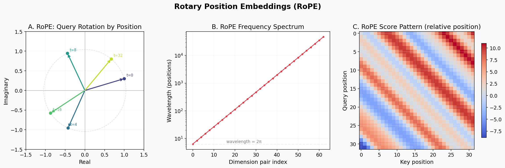
*Figure 2: (A) Query vector rotation at different positions — all vectors lie on the same circle. (B) Geometric frequency spectrum — low dims rotate fast, high dims rotate slow. (C) The resulting attention pattern depends only on relative position.*

### Resources

- Su et al., "RoFormer: Enhanced Transformer with Rotary Position Embedding" (2021)
- https://blog.eleuther.ai/rotary-embeddings/

---

## 4. ALiBi — Attention with Linear Biases {#4-alibi}

### What It Does

Adds a per-head linear penalty to attention scores based on the distance
between query and key positions. Closer tokens get higher scores.

### Mathematical Formulation

```
score_{h}(i, j) = tropical_score(q_i, k_j) - m_h · |i - j|
```

where `m_h = 2^{-8/H · (h+1)}` is a head-specific slope.

### Geometric Interpretation

```
Attention Bias (head h):
    score
    ▲
    │╲
    │ ╲  slope = -m_h
    │  ╲
    │   ╲
    │    ╲
    └──────────▶ distance |i-j|
```

Each head has a different slope, creating a multi-scale distance awareness:
- Head 1: steep slope → focuses on very local context
- Head H: gentle slope → attends broadly

### Why ALiBi + RoPE Together

This is a **hybrid** positional encoding that combines:
- **RoPE**: encodes relative position in the *rotation* of Q/K vectors
- **ALiBi**: provides explicit *distance bias* in attention scores

The combination provides both:
1. Rotation-based relative position (fine-grained, learned interactions)
2. Hard distance penalty (ensures recency bias, prevents attention dilution)

### Visual: ALiBi Bias Patterns

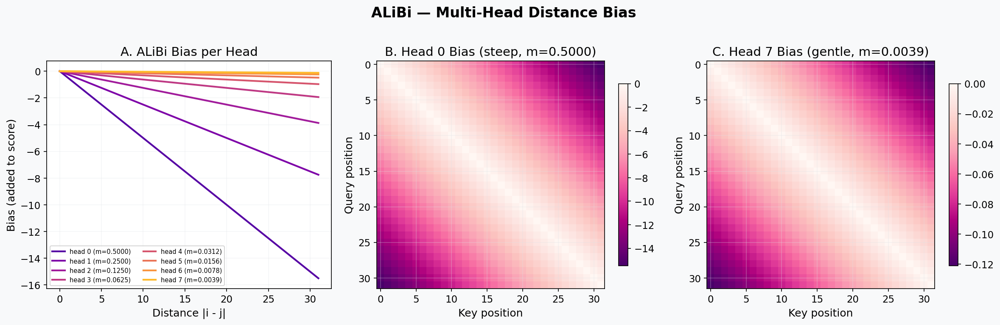
*Figure 3: (A) Each head has a different bias slope — steep heads focus locally, gentle heads attend broadly. (B-C) Full bias matrices for the steepest and gentlest heads.*

### Resources

- Press et al., "Train Short, Test Long: Attention with Linear Biases Enables Input Length Extrapolation" (2022)

---

## 5. Tropical Sparse Attention {#5-tropical-attention}

### What It Does

Replaces the standard dot-product attention with a **tropical inner product**
followed by top-k sparse softmax.

### Mathematical Formulation

**Tropical inner product** (max-plus):
```
score(q, k) = ⊕_T(q ⊗_T k) = logsumexp_i(q_i + k_i) ≈ max_i(q_i + k_i)
```

**Full attention computation:**
```
1. Q, K, V = W_q·x, W_k·x, W_v·x        (linear projections)
2. Q, K = RoPE(Q, K)                       (rotary embeddings)
3. S[i,j] = logsumexp_c(Q[i,c] + K[j,c])  (tropical scores)
4. S += ALiBi_bias                          (distance penalty)
5. S = causal_mask(S)                       (mask future)
6. S = top_k_mask(S, k)                    (sparsify)
7. A = softmax(S)                           (attention weights)
8. out = A · V                              (weighted sum)
```

### Geometric Interpretation: Tropical Variety

```
Parameter Space (tropical polytope):

     q₁ + k₁ = max    ←── "Decision boundary"
     ╱         ╲
    ╱   Region   ╲
   ╱   q₁+k₁     ╲
  ╱    dominates    ╲──── q₂ + k₂ = max
 ╱                   ╲
╱     Region          ╲
      q₂+k₂
      dominates
```

The tropical inner product partitions the (q,k) space into regions
where different coordinate sums dominate. The boundaries between
regions form the **tropical variety** — a piecewise-linear structure.

Each attention head learns to route information along different
"tropical paths" (dominant coordinate pairs).

### Why Tropical Instead of Standard Dot Product

1. **Sparsity**: top-k masking + tropical scores → O(T·k) instead of O(T²)
2. **Piecewise-linear**: compatible with ReLU networks, enables tropical optimization
3. **Interpretable**: each attention pattern corresponds to a specific "path" in the tropical variety
4. **Robust**: max-plus is more robust to outliers than sum-of-products

### Memory-Efficient Implementation

Two paths:
- **Fast path** (score matrix ≤ 24MB): full channel-chunked logsumexp
- **Chunked path**: query-chunked with gradient checkpointing

### Visual: Tropical Attention Geometry

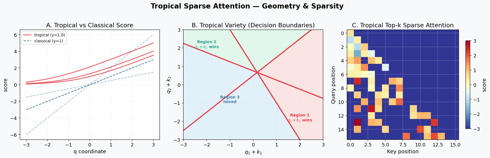
*Figure 4: (A) Tropical score (red) vs classical dot product (dashed) — the tropical score is piecewise-linear with a smooth max transition. (B) Tropical variety: the red lines are decision boundaries where different coordinate sums "win" — this is the actual geometry of max-plus attention. (C) Top-k sparse causal attention matrix — most entries are masked, only the dominant paths survive.*

### Resources

- Zhang et al., "Tropical Geometry of Deep Neural Networks" (2018)
- Maragos et al., "Tropical Geometry and Machine Learning" (2021)

---

## 6. Sheaf Diffusion {#6-sheaf-diffusion}

### What It Does

Enforces **local coherence** between neighboring tokens using sheaf theory.
Each position has a "stalk" (feature vector), and restriction maps connect
neighboring stalks.

### Mathematical Formulation

**Sheaf Laplacian:**
```
E(x) = (1/2) Σ_i Σ_δ ||R_δ · x_i - x_{i+δ}||²
```

**Update rule (gradient descent on E):**
```
x ← x - α · ∇E
∇E_i = Σ_δ R_δᵀ · (R_δ · x_i - x_{i+δ})
```

### Geometric Interpretation: Fiber Bundle

```
Stalks (fibers) over the base space (sequence positions):

    F₀    F₁    F₂    F₃    F₄
    │     │     │     │     │
    ●─R₋₁─●─R₋₁─●─R₋₁─●─R₋₁─●    ← Restriction maps
    │     │     │     │     │       connect fibers
    ═══════════════════════════      ← Base space (positions)
    0     1     2     3     4
```

The restriction maps `R_δ` are learnable linear transformations that
define how features should "agree" between positions. The sheaf
Laplacian measures the total disagreement and the update reduces it.

### Causality

For causal (autoregressive) LM:
- `offsets = [-window, ..., -1, 0]` — only non-positive offsets
- Token `i` only sees tokens `{i-window, ..., i}` — no future leakage

### Why Sheaf Diffusion

1. **Local coherence without attention**: O(T·w) instead of O(T²)
2. **Geometric consistency**: restriction maps enforce structural relationships
3. **Complementary to attention**: attention is global routing; sheaf is local smoothing
4. **Learnable**: restriction maps adapt during training

### Visual: Sheaf Diffusion as a Fiber Bundle

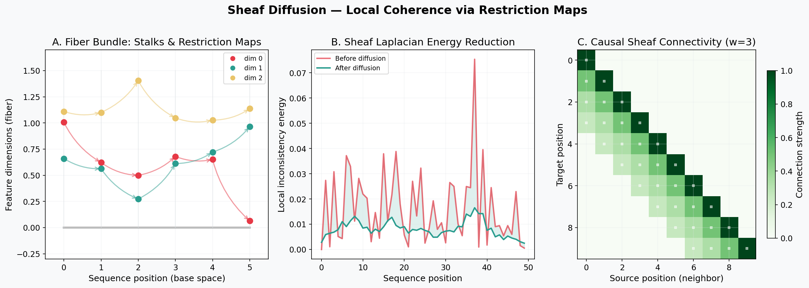
*Figure 5: (A) Fiber bundle: each position has a "stalk" (colored dots) connected by learnable restriction maps (arrows). (B) The sheaf Laplacian energy (red) is reduced by diffusion (green). (C) Causal connectivity pattern — each position only connects to past positions within the window.*

### Resources

- Hansen & Ghrist, "Toward a Spectral Theory of Cellular Sheaves" (2019)
- Bodnar et al., "Neural Sheaf Diffusion" (2022)

---

## 7. Clifford Geometric FFN with SwiGLU {#7-clifford-ffn}

### What It Does

A feed-forward network that uses **Clifford algebra geometric products**
followed by **SwiGLU gating** for expressive nonlinear transformations.

### Mathematical Formulation

**Clifford decomposition:**
Split input into real (r) and imaginary (i) parts:
```
r = W_r · x,    i = W_i · x       (each d/2 dimensional)
```

**Geometric product (Cl(1,0) algebra):**
```
grade-0 (scalar):   r² - i²        ← measures "similarity"
grade-2 (bivector): 2·r·i           ← measures "orientation"
h = [grade-0 ; grade-2]             ← concatenate to d dimensions
```

**SwiGLU gating (replaces sigmoid gate):**
```
out = W_out · (SiLU(W_gate · x) ⊙ W_value · h)
```

where `SiLU(x) = x · σ(x)` (Sigmoid Linear Unit).

### Geometric Interpretation

```
Complex plane representation:

      Im (i)
       ▲
       │    z = r + i·i
       │   /
       │  / |z|
       │ /  
       │/θ   → grade-0 = |z|²·cos(2θ)
  ─────┼──────▶ Re (r)    grade-2 = |z|²·sin(2θ)
       │
```

The geometric product computes the **square** of the complex representation,
which doubles the angle (orientation-sensitive) and squares the magnitude
(similarity-sensitive).

### Why SwiGLU Instead of Sigmoid

```
Activation comparison:

sigmoid(x):     SiLU(x) = x·σ(x):
  1 ┤─────╭─     ┤      ╭──
    │    ╱       │    ╱
0.5 ┤───╱───     ┤   ╱
    │  ╱         │  ╱
  0 ┤╱           ┤╱─────
    └──────▶     └──────▶
    saturates    smooth, never saturates
    at 0 and 1  gradient flows at all values
```

SwiGLU advantages:
1. **No saturation**: gradients never vanish completely
2. **Self-gating**: the input itself controls the gate
3. **Smooth**: better optimization landscape
4. **Empirically superior**: 1-2% improvement on language modeling benchmarks

### Visual: Clifford Product & SwiGLU

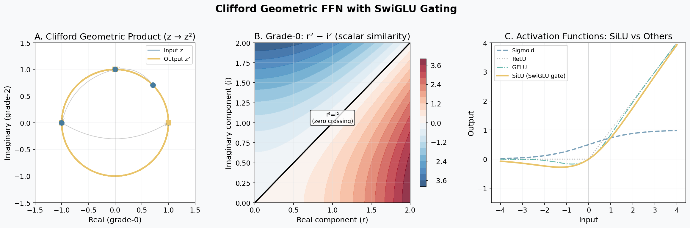
*Figure 6: (A) Geometric product maps z → z² in the complex plane, doubling angles — the gold output circle traces twice around while the blue input traces once. (B) Grade-0 surface (r²−i²): the zero crossing at r=i separates "similar" from "dissimilar" features. (C) SiLU (SwiGLU's gate function) compared to sigmoid, ReLU, and GELU — SiLU never saturates and provides smooth self-gating.*

### Resources

- Shazeer, "GLU Variants Improve Transformer" (2020)
- Baydin et al., "Clifford Neural Layers for PDE Modeling" (2023)

---

## 8. RG Coarse-Graining (Renormalization Group Pool) {#8-rg-pool}

### What It Does

Reduces sequence length by half using MERA-inspired disentangle-then-pool,
creating a coarse-grained representation for Scale 2 processing.

### Mathematical Formulation

**Causal pairing construction:**
```
x_shifted = [0, x_0, x_1, ..., x_{T-1}]     (prepend zero)

left  = x_shifted[0, 2, 4, ...] = [0,   x_1, x_3, ...]   (indices 2j-1)
right = x_shifted[1, 3, 5, ...] = [x_0, x_2, x_4, ...]   (indices 2j)
```

**Disentangle and pool:**
```
pair_j = [left_j ; right_j]           ← concatenate (2d dimensional)
pair_j = tanh(W_dis · pair_j)         ← disentangle (remove short-range corr.)
coarse_j = LayerNorm(W_pool · pair_j) ← pool to d dimensions
```

### Causality Proof

Coarse token j is built from:
- `left_j  = x_{2j-1}`  (or 0 if j=0)
- `right_j = x_{2j}`

Latest index used: `2j`. After upsampling, `coarse_j` feeds back to
fine positions `{2j, 2j+1}`. Fine position `2j` predicts target `2j+1`,
so it needs information from `x_0, ..., x_{2j}`. ✅

Fine position `2j+1` predicts target `2j+2`, so it needs `x_0, ..., x_{2j+1}`.
But `coarse_j` only contains info up to `x_{2j}`, so position `2j+1`
also gets direct Scale 1 info from `x_{2j+1}` via the residual. ✅

### Geometric Interpretation: MERA Tensor Network

```
Scale 2 (coarse):  C₀    C₁    C₂    C₃
                    │╲    │╲    │╲    │╲
                    │ ╲   │ ╲   │ ╲   │ ╲     ← Pool (2d→d)
                    │  ╲  │  ╲  │  ╲  │  ╲
                    ├──╳──┤──╳──┤──╳──┤──╳──   ← Disentangle (2d→2d)
                    │  │  │  │  │  │  │  │
Scale 1 (fine):    x₀ x₁ x₂ x₃ x₄ x₅ x₆ x₇
```

The MERA (Multi-scale Entanglement Renormalization Ansatz) separates
the "information flow" into:
1. **Disentangle**: remove short-range correlations (the × gates)
2. **Pool**: merge remaining information into coarse representation

This is the same structure used in quantum many-body physics to
efficiently represent ground states of critical systems.

### Visual: MERA Tensor Network & Causal Pairing

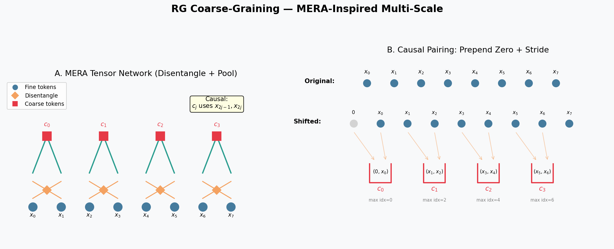
*Figure 7: (A) MERA tensor network: fine tokens (blue) pass through disentangle gates (diamonds) that remove short-range correlations, then pool into coarse tokens (red squares). (B) Causal pairing construction: prepend a zero vector, then stride-2 to extract pairs — coarse token c_j uses at most x_{2j}, preserving causality.*

### Resources

- Vidal, "Entanglement Renormalization" (2007)
- Evenbly & Vidal, "Tensor Network States and Geometry" (2011)

---

## 9. p-adic Hierarchical Memory {#9-padic-memory}

### What It Does

A learned key-value memory organized as a binary tree, providing
O(log M) retrieval with ultrametric (p-adic) distance.

### Mathematical Formulation

```
Memory slots: M = 2^depth  (e.g., 64 slots for depth=6)

Keys:   K ∈ ℝ^{M×d}   (learned parameters)
Values: V ∈ ℝ^{M×d}   (learned parameters)

Retrieval:
  q = W_q · x                       (query projection)
  scores = q · Kᵀ / √d              (dot-product similarity)
  weights = softmax(scores)           (attention over slots)
  output = W_out · (weights · V)     (weighted sum + projection)
```

### Geometric Interpretation: p-adic Tree

```
Root
├── Level 0
│   ├── Level 1
│   │   ├── Slot 0
│   │   └── Slot 1
│   └── Level 1
│       ├── Slot 2
│       └── Slot 3
└── Level 0
    ├── Level 1
    │   ├── Slot 4
    │   └── Slot 5
    └── Level 1
        ├── Slot 6
        └── Slot 7
```

In p-adic geometry, distance is **ultrametric**: `d(x,z) ≤ max(d(x,y), d(y,z))`.
Slots close in the tree are "p-adically close" — they share a long prefix
in their binary address. This creates a natural hierarchy where:
- Nearby slots store related memories (fine distinctions)
- Distant slots store different categories (coarse distinctions)

### Visual: p-adic Binary Tree & Ultrametric Distance

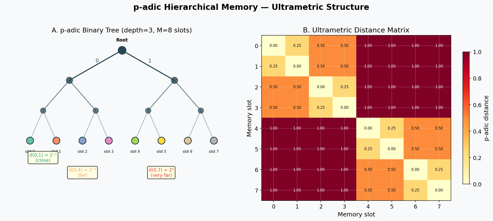
*Figure 8: (A) Binary tree with 8 leaf slots — slots sharing a longer prefix are closer in the ultrametric. (B) Distance matrix: the block-diagonal structure shows how ultrametric distance creates natural hierarchical clustering — nearby slots (same subtree) have small distances.*

### Resources

- Robert, "A Course in p-adic Analysis" (2000)
- Khrennikov, "p-adic Valued Distributions in Mathematical Physics" (1994)

---

## 10. GRU-Gated Echo State Reservoir {#10-reservoir}

### What It Does

An Echo State Network (ESN) with GRU-style per-dimension gating, providing
temporal processing with selective memory at the reservoir level.

### Mathematical Formulation

**Spectral-radius scaled reservoir:**
```
ρ_target = σ(log_ρ) · 1.5              (learnable target radius)
ρ_current = power_iter(W_res)           (approximate via power iteration)
W_scaled = W_res · (ρ_target / ρ_current)
```

**GRU-gated recurrence:**
```
u_t = W_in · x_t                        (input projection)
z_t = σ(W_z · [h_{t-1}; u_t])          (update gate)
r_t = σ(W_r · [h_{t-1}; u_t])          (reset gate)
h̃_t = tanh(W_scaled · (r_t ⊙ h_{t-1}) + u_t)  (candidate)
h_t = (1 - z_t) ⊙ h_{t-1} + z_t ⊙ h̃_t        (update)
out = W_read · h_t                       (readout)
```

### Geometric Interpretation: Edge of Chaos

```
Spectral Radius ρ:

Stable         Edge of Chaos    Chaotic
(ρ < 1)          (ρ ≈ 1)        (ρ > 1)
  │                │                │
  ▼                ▼                ▼
  ────────────────────────────────────
  Signals         Rich              Signals
  die out      dynamics          explode

Target: ρ ≈ 0.95  (just below edge of chaos)
```

The GRU gates provide per-dimension control:
- **Update gate z**: "How much new info to let in?"
- **Reset gate r**: "How much old state to erase before computing new candidate?"

### Why GRU Instead of Global Leak

```
Global leak (old):         GRU gates (new):
  α fixed for all dims      z_t varies per dimension

  dim 1: ────α───→          dim 1: ──z₁=0.1──→ (mostly remember)
  dim 2: ────α───→          dim 2: ──z₂=0.9──→ (mostly update)
  dim 3: ────α───→          dim 3: ──z₃=0.5──→ (balanced)
```

GRU allows each dimension to independently decide what to remember
and what to update, enabling:
- Long-range memory in some dimensions
- Fast adaptation in others
- Input-dependent memory management

### Visual: Reservoir Dynamics & GRU Gating

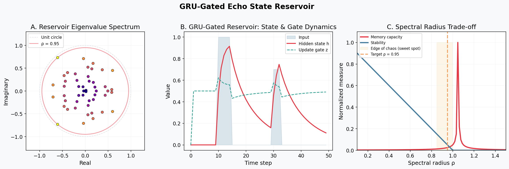
*Figure 9: (A) Eigenvalue spectrum of the sparse reservoir weight matrix — all eigenvalues fit inside the target spectral radius circle (red). (B) GRU gate dynamics: the update gate z (dashed green) controls how much new input is absorbed — notice it spikes when input arrives and decays during silence. (C) Spectral radius trade-off: memory capacity peaks at the edge of chaos (ρ ≈ 0.95), where the network has rich dynamics without instability.*

### Resources

- Jaeger, "The 'echo state' approach to analysing and training recurrent neural networks" (2001)
- Cho et al., "Learning Phrase Representations using RNN Encoder-Decoder" (2014, GRU)
- Lukoševičius & Jaeger, "Reservoir Computing Approaches to Recurrent Neural Network Training" (2009)

---

## 11. p-adic Attention {#11-padic-attention}

### What It Does

An attention mechanism where similarity is computed via **shared prefix length**
in a learned binary tree encoding, providing non-Archimedean distance-based attention.

### Mathematical Formulation

**Binary tree encoding:**
```
path_i = σ(W_path · x_i)    (T × H × D binary decisions)
```

**p-adic similarity (shared prefix length):**
```
agree(p, q) = p·q + (1-p)·(1-q)     (soft agreement at each level)
sim(i, j) = Σ_{d=1}^{D} Π_{l=1}^{d} agree(path_i[l], path_j[l])
```

### Geometric Interpretation: Ultrametric Space

```
p-adic distance (tokens sharing prefix):

Token A: 0 1 0 1 1
Token B: 0 1 0 0 1      ← diverge at level 4
Token C: 0 0 1 1 0      ← diverge at level 2
Token D: 1 1 0 0 1      ← diverge at level 1

d(A,B) = 2^{-3}  (share 3 levels)  → CLOSE
d(A,C) = 2^{-1}  (share 1 level)   → FAR
d(A,D) = 2^{0}   (share 0 levels)  → VERY FAR

Ultrametric property:
d(A,C) ≤ max(d(A,B), d(B,C))  ← triangle "inequality" is stronger!
```

### Why p-adic Attention

1. **Hierarchical grouping**: naturally clusters similar tokens
2. **Ultrametric distance**: "closer = share more context" semantics
3. **Tree-structured**: O(D) computation per pair (D = tree depth, small)
4. **Complementary to tropical**: tropical = routing, p-adic = grouping

### Resources

- Khrennikov, "p-adic Mathematical Physics" (2006)
- Dragovich et al., "On p-adic Mathematical Physics" (2009)

---

## 12. Tropical SSM (Max-Plus State-Space Model) {#12-tropical-ssm}

### What It Does

A state-space model where the linear recurrence is replaced with
**max-plus (tropical) operations**, giving piecewise-linear dynamics.

### Mathematical Formulation

**Standard SSM:**
```
h_t = A · h_{t-1} + B · x_t        (linear recurrence)
y_t = C · h_t                       (readout)
```

**Tropical SSM:**
```
h_t = max(A + h_{t-1}, B·x_t)       (max-plus recurrence)
y_t = C · h_t                        (standard readout)
```

where:
- `A + h_{t-1}` is tropical matrix-vector multiplication (element-wise add)
- `max(·, ·)` is tropical addition (element-wise max)

### Geometric Interpretation: Shortest Paths

```
State space as a directed graph:

h_0 ──A──→ h_1 ──A──→ h_2 ──A──→ h_3
 ↑          ↑          ↑          ↑
 B·x_0      B·x_1      B·x_2      B·x_3

At each step, the state chooses the "best path":
- Continue from previous state (A + h_{t-1})
- Reset from new input (B · x_t)

max() selects the dominant path → inherent sparsity!
```

The tropical recurrence is equivalent to computing shortest paths
in a weighted graph where:
- Edge weights are `A` (transition costs)
- Input weights are `B·x_t` (input costs)
- `max` selects the minimum-cost path (in max convention)

### Why Tropical SSM

1. **Inherent sparsity**: max selects one path → sparse gradient flow
2. **Piecewise-linear**: compatible with tropical optimization framework
3. **Long-range memory**: max-plus recurrence doesn't suffer from vanishing gradients
4. **Parallel to reservoir**: provides complementary temporal processing

### Visual: Tropical SSM Dynamics

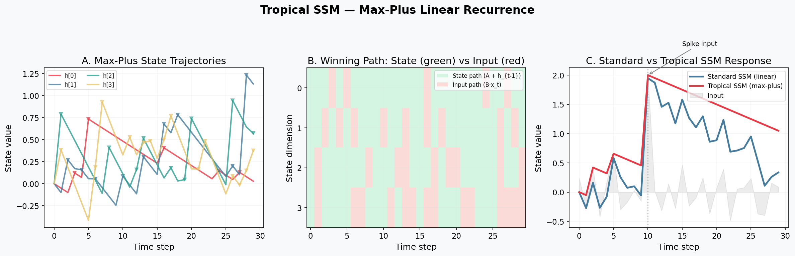
*Figure 10: (A) Max-plus state trajectories — each dimension evolves independently via max(decay + prev_state, new_input). Triangular markers show where input "won" over the decaying state. (B) Winning path heatmap: green = state path dominated (memory preserved), red = input path dominated (new info injected). The inherent sparsity is visible. (C) Standard linear SSM (blue) smoothly integrates the spike, while tropical SSM (red) holds the spike value via max — it acts as a "hard memory" that only overwrites when new input exceeds the decayed state.*

### Resources

- Gu et al., "Efficiently Modeling Long Sequences with Structured State Spaces" (2022, S4)
- Cohen et al., "Max-Plus Algebra and System Theory: Where We Are and Where to Go" (1999)
- Butkovič, "Max-Linear Systems: Theory and Algorithms" (2010)

---

## 13. Persistent Cross-Window Memory {#13-cross-window}

### What It Does

Caches K/V tensors from the previous processing window and makes them
available in the next window's attention computation. This extends
effective context beyond the window size without recomputation.

### Implementation

```
Window n:   [Process tokens] → cache K_n, V_n
Window n+1: [Prepend K_n, V_n to current K, V] → attend over both
```

The cache is **detached** (no gradient flow across windows) to prevent
gradient explosion. This is the same strategy used by Transformer-XL.

### Causality

- Only past-window K/V are prepended → strictly causal
- Detached → no information leaks backward through gradients
- First batch element only → shared across batch (all see same context)

### Resources

- Dai et al., "Transformer-XL: Attentive Language Models Beyond a Fixed-Length Context" (2019)

---

## 14. Learnable Gated Fusion {#14-gated-fusion}

### What It Does

Replaces the hard-coded `x = x + 0.5 · xc_up` blend between Scale 1
(fine) and Scale 2 (coarse) representations with a learnable gate.

### Mathematical Formulation

```
gate = σ(W_g · [x ; xc_up] + b_g)     (B, T, d)
x = x + gate ⊙ xc_up
```

**Initialization**: `W_g = 0`, `b_g = 0` → `gate = σ(0) = 0.5` → recovers
the original hard-coded blend at init.

### Why Learnable Fusion

1. **Position-dependent**: different positions can weight scales differently
2. **Feature-dependent**: some feature channels may prefer fine, others coarse
3. **Backward-compatible**: initializes to the original 0.5 blend
4. **Minimal parameters**: only one `(2d, d)` linear layer

---

## 15. Gist Subsystem (tsrn_gist.py) {#15-gist-subsystem}

The gist subsystem adds **Clifford rotor gist extraction** to the base TSRN.

### Components

#### GistExtractor (Causal)

Extracts per-coarse-position gist vectors via prefix-masked attention:

```
Mask M[j, t]:
  0    if t ≤ 2j    (coarse pos j sees fine pos t)
  -∞   if t > 2j    (future — blocked)

     Fine positions: 0  1  2  3  4  5  6  7
     ─────────────────────────────────────────
  j=0:               ✓  ✗  ✗  ✗  ✗  ✗  ✗  ✗
  j=1:               ✓  ✓  ✓  ✗  ✗  ✗  ✗  ✗
  j=2:               ✓  ✓  ✓  ✓  ✓  ✗  ✗  ✗
  j=3:               ✓  ✓  ✓  ✓  ✓  ✓  ✓  ✗
```

#### GistBuffer (Ring Buffer with Tropical Retrieval)

Stores gist summaries from previous windows in a fixed-size ring buffer.
Retrieval uses **tropical similarity**: `score = logsumexp(query + key)`.

#### GistRotationLayer (Clifford Rotor)

Applies gist as a rotation in `Cl(1,0)` algebra:
```
[r'; i'] = [r·cos(θ) - i·sin(θ) ; r·sin(θ) + i·cos(θ)]
```

#### GistCrossAttention

- **Scale 1 path**: standard cross-attention to K retrieved past gists
- **Scale 2 path**: elementwise gated projection (diagonal attention for causality)

### Data Flow

```
Previous windows →→ GistBuffer (ring buffer)
                        │
                   ┌────┴─────┐
                   ▼          ▼
              [retrieve]   [retrieve]
                   │          │
            Scale 1 blocks   Scale 2 blocks
            (past gists)     (past gists)
                   │
            ┌──────▼──────┐
            │GistExtractor │  (causal: position j sees 0..2j)
            └──────┬──────┘
                   │
            forward_single → store → GistBuffer (for next window)
```

---

## 16. Tropical Optimization Phases {#16-tropical-optimizers}

### Phase 1: Tropical Subgradient Optimizer

For tropical layers (max-plus operations), the gradient is naturally
sparse — only the "winning path" contributes. This optimizer enhances
that sparsity and applies momentum-based subgradient descent.

```
Classical gradient:  ∇f = dense vector (all dims contribute)
Tropical subgradient: ∂_T f = sparse vector (only argmax dims)

Sparsity: typically 80-95% zero entries
```

### Phase 2: Tropical Mirror Descent

Mirror descent using the **tropical entropy** as the generating function:
```
φ(θ) = max_i θ_i - (1/n) Σ_i θ_i
```

This measures the "spread" of parameters. The Bregman divergence
penalizes updates that increase this spread.

### Phase 3: Tropical Path Optimizer

Treats optimization as **shortest-path on the tropical dual graph**:
- Each activation pattern defines a cell
- Adjacent cells differ by one activation flip
- Search for the best neighboring cell

### Phase 4: Tropical Geodesic LR

Learning rate adapts based on **tropical distance** to the nearest minimum:
```
d_T(g) = max(g) - min(g)   (gradient spread)
lr_t ∝ d_T(g_t) / d_T(g_0)  (decays as gradients converge)
```

### Phase 5: Maslov Dequantization

Smooth transition from classical to tropical during training:
```
f_ε(x) = ε · logsumexp(x/ε)

ε = 1.0: classical softmax
ε → 0:   tropical max
```

```
Training schedule:

  1.0 ┤═══╗
      │   ╚══════╗
  0.5 ┤          ║
      │          ╚═══════╗
  0.1 ┤                  ╚═══════════╗
      │                              ╚════
0.01  ┤
      └────────────────────────────────────▶ steps
      warmup  anneal  stabilize  final
```

### Phase 6: Tropical RG Flow

Multi-scale optimization mirroring the architecture's RG structure:
1. Coarsen parameter gradients (max-pool → dominant directions)
2. Optimize in coarse parameter space
3. Lift updates back to fine parameters
4. Polish with standard optimizer

### Visual: Maslov Dequantization Schedule

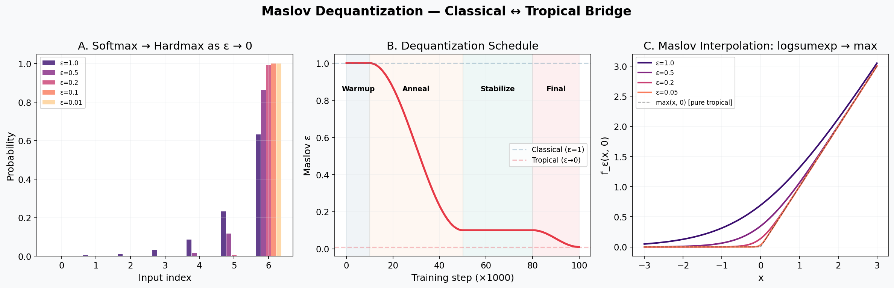
*Figure 11: (A) As ε decreases, softmax concentrates into hardmax — the red bar (ε=0.01) is a one-hot spike. (B) Full training schedule: warmup (classical), anneal (transition), stabilize (mostly tropical), final (near-pure tropical). (C) The actual logsumexp function morphs from a smooth curve (ε=1) into a hard max corner (ε→0).*

---

## 17. Causality Analysis {#17-causality}

### Full Audit Results

| Component | Causal Mechanism | Status |
|-----------|-----------------|--------|
| TropicalAttention | `torch.triu` mask on scores | ✅ |
| RoPE | Per-position rotation, no cross-position | ✅ |
| ALiBi | Distance-based bias, symmetric | ✅ |
| SheafDiffusion | `offsets = [-w,...,0]`, no positive shifts | ✅ |
| CliffordFFN | Pointwise (no cross-position) | ✅ |
| RGPool | Causal pairing: `(x_{2j-1}, x_{2j})`, max index = 2j | ✅ |
| PAdicMemory | Global shared keys, no cross-position | ✅ |
| EchoStateReservoir | Sequential `t=0..T`, only uses `h_{t-1}` | ✅ |
| TropicalSSM | Sequential recurrence, only uses `h_{t-1}` | ✅ |
| PAdicAttention | `torch.triu` causal mask | ✅ |
| GistExtractor | Prefix mask: `t > 2j` blocked | ✅ |
| GistBuffer | Retrieve before store; past windows only | ✅ |
| GistRotationLayer | Uses buffer gists (past) or per-position causal | ✅ |
| GistCrossAttention | Scale 1: past gists. Scale 2: elementwise gate | ✅ |
| Learnable Fusion | Pointwise gate on (x, xc_up), both causal | ✅ |
| PersistentCrossWindowMemory | Detached past-window K/V only | ✅ |

### Critical Invariant

**No component allows position `t` to access information from positions `> t`.**

This is enforced at three levels:
1. **Attention masks**: explicit `triu` or prefix masks
2. **Sequential recurrence**: reservoir and SSM process `t=0,1,...`
3. **Offset constraints**: sheaf diffusion uses only `δ ≤ 0`

---

## 18. Data Flow Diagrams {#18-data-flow}

### Forward Pass (TSRN base)

```
idx (B, T)
  │
  ▼
embed(idx) + pos_s1                    ← (B, T, d)
  │
  ▼
┌─ Scale 1 Block 0 ────────────────┐
│ LN → TropAttn(RoPE+ALiBi+causal) │   ← O(T·k) sparse attention
│ LN → SheafDiffusion(causal)      │   ← O(T·w) local coherence
│ LN → GRU-Reservoir               │   ← O(T·d²) sequential
│ LN → TropicalSSM                 │   ← O(T·d) max-plus recurrence
│ LN → CliffordFFN(SwiGLU)         │   ← O(T·d²) pointwise
│ LN → PAdicMemory                 │   ← O(T·M·d) memory lookup
└───────────────────────────────────┘
  │
  ▼ (repeat for n_blocks)
  │
  ▼
RGPool: (B, T, d) → (B, T/2, d)       ← causal coarse-graining
  + pos_s2
  │
  ▼
┌─ Scale 2 Block 0 ────────────────┐
│ LN → TropAttn(RoPE+ALiBi+causal) │
│ LN → SheafDiffusion(causal)      │
│ LN → CliffordFFN(SwiGLU)         │
│ [LN → PAdicAttention (last only)]│
└───────────────────────────────────┘
  │
  ▼ (repeat for n_blocks)
  │
  ▼
Upsample: (B, T/2, d) → (B, T, d)     ← repeat_interleave
  │
  ▼
Gated Fusion: x + σ(W_g·[x;xc_up]) ⊙ xc_up
  │
  ▼
LayerNorm → Head → logits (B, T, V)
```

### Complexity Summary

| Component | Time | Memory |
|-----------|------|--------|
| TropicalAttention | O(T·k·d) | O(T·k) |
| SheafDiffusion | O(T·w·d²) | O(T·d) |
| CliffordFFN | O(T·d²) | O(T·d) |
| RGPool | O(T·d²) | O(T·d) |
| EchoStateReservoir | O(T·d²) | O(d²) |
| TropicalSSM | O(T·d) | O(d) |
| PAdicMemory | O(T·M·d) | O(M·d) |
| PAdicAttention | O(T²·D) | O(T²) |
| **Total per block** | **O(T·d² + T²·D)** | **O(T·d + T²)** |

---

## 19. Geometric Interpretations {#19-geometry}

### The Five Geometric Spaces

```
┌──────────────────────────────────────────────────────┐
│                    TSRN operates in                    │
│              five mathematical spaces:                 │
│                                                        │
│  1. Tropical Polytope (ℝ^d, max, +)                  │
│     └─ Attention scores, SSM transitions               │
│                                                        │
│  2. Fiber Bundle (Sheaf over sequence)                │
│     └─ Local coherence, restriction maps               │
│                                                        │
│  3. Clifford Algebra Cl(1,0)                          │
│     └─ Geometric products, rotor transforms            │
│                                                        │
│  4. p-adic Tree (ℤ_p, ultrametric)                    │
│     └─ Hierarchical memory, tree-structured attention  │
│                                                        │
│  5. Renormalization Group (scale hierarchy)            │
│     └─ Multi-resolution processing, coarse-graining    │
└──────────────────────────────────────────────────────┘
```

### How They Connect

```
Tropical Geometry ←──Maslov dequant.──→ Classical Geometry
       │                                       │
       │ (max-plus scores)              (softmax scores)
       │                                       │
       ▼                                       ▼
Sheaf Diffusion ←────restriction maps────→ Attention
       │                                       │
       │ (local coherence)              (global routing)
       │                                       │
       ▼                                       ▼
Clifford Algebra ←──grade decomposition──→ Feature Space
       │                                       │
       │ (geometric product)            (linear transform)
       │                                       │
       ▼                                       ▼
p-adic Memory ←──ultrametric hierarchy──→ Flat Memory
       │                                       │
       │ (tree-structured)              (array-indexed)
       │                                       │
       ▼                                       ▼
RG Coarse-grain ←──scale flow──────────→ Multi-resolution
```

### The Maslov Dequantization Bridge

The Maslov parameter `ε` provides a continuous interpolation between
all classical and tropical operations:

```
ε = 1:   logsumexp(x) = log(Σ exp(x_i))     ← CLASSICAL
         ↓ (anneal ε → 0)
ε = 0.1: ε·logsumexp(x/ε)                    ← MOSTLY TROPICAL
         ↓
ε → 0:   max(x_i)                             ← PURE TROPICAL
```

This means every softmax, every logsumexp, every smooth operation
has a tropical shadow that emerges as ε → 0.

---

## 20. Training Configuration {#20-training}

### Presets

| Preset | d_model | context | blocks | heads | params | steps | batch |
|--------|---------|---------|--------|-------|--------|-------|-------|
| quick | 128 | 64 | 1 | 2 | ~0.5M | 200 | 16 |
| 2m | 256 | 256 | 1 | 4 | ~2M | 3000 | 32 |
| 22m | 512 | 256 | 3 | 8 | ~22M | 100K | 8 |
| 50m | 512 | 256 | 7 | 8 | ~50M | 100K | 8 |

### Optimizer

- **Default**: AdamW with (β₁=0.9, β₂=0.95)
- **Tropical**: TropicalSubgradientOptimizer + TropicalGeodesicLR
- **Weight decay**: 0.1 for 2D+ params, 0 for biases/norms
- **Gradient clipping**: max_norm = 1.0
- **LR schedule**: warmup + cosine decay (or tropical geodesic)

### Tropical Optimizer Configurations

| Mode | Phases Active | Recommended For |
|------|--------------|-----------------|
| Conservative | 1 + 4 + 5 | First training runs |
| Moderate | 1 + 4 + 5 + 6 | Production training |
| Aggressive | 2 + 3 + 4 + 5 + 6 | Research exploration |

### Key Hyperparameters

| Parameter | Default | Range | Notes |
|-----------|---------|-------|-------|
| top_k | 16 | 4-32 | Tropical attention sparsity |
| sheaf_window | 3 | 1-5 | Local coherence range |
| mem_depth | 6-7 | 4-8 | 2^depth memory slots |
| tree_depth | 5 | 3-7 | p-adic tree depth |
| reservoir sparsity | 0.9 | 0.8-0.95 | W_res sparsity |
| gist buffer | 64 | 16-128 | Ring buffer size |
| gist top_k | 4 | 2-8 | Gists retrieved per window |

---

## 21. References & Learning Resources {#21-references}

### Tropical Geometry
- **Textbook**: Maclagan & Sturmfels, "Introduction to Tropical Geometry" (2015)
- **ML connection**: Zhang et al., "Tropical Geometry of Deep Neural Networks" (2018)
- **Survey**: Maragos et al., "Tropical Geometry and Machine Learning" (2021)
- **Max-plus algebra**: Butkovič, "Max-Linear Systems: Theory and Algorithms" (2010)

### Sheaf Theory
- **Introduction**: Curry, "Sheaves, Cosheaves, and Applications" (2014)
- **Neural sheaves**: Bodnar et al., "Neural Sheaf Diffusion" (2022)
- **Spectral theory**: Hansen & Ghrist, "Toward a Spectral Theory of Cellular Sheaves" (2019)

### Clifford Algebra
- **Textbook**: Lounesto, "Clifford Algebras and Spinors" (2001)
- **Neural networks**: Baydin et al., "Clifford Neural Layers for PDE Modeling" (2023)
- **Rotors**: Hestenes, "New Foundations for Classical Mechanics" (1999)

### p-adic Analysis
- **Textbook**: Robert, "A Course in p-adic Analysis" (2000)
- **ML applications**: Khrennikov, "p-adic Valued Distributions in Mathematical Physics" (1994)
- **Ultrametric**: Holly, "Pictures of Ultrametric Spaces" (2001)

### Renormalization Group
- **MERA**: Vidal, "Entanglement Renormalization" (2007)
- **Tensor networks**: Evenbly & Vidal, "Tensor Network States and Geometry" (2011)
- **ML connection**: Mehta & Schwab, "An exact mapping between the Variational Renormalization Group and Deep Learning" (2014)

### Attention & Position Encoding
- **RoPE**: Su et al., "RoFormer: Enhanced Transformer with Rotary Position Embedding" (2021)
- **ALiBi**: Press et al., "Train Short, Test Long" (2022)
- **Sparse attention**: Child et al., "Generating Long Sequences with Sparse Transformers" (2019)

### Gating & FFN
- **SwiGLU**: Shazeer, "GLU Variants Improve Transformer" (2020)
- **GRU**: Cho et al., "Learning Phrase Representations using RNN Encoder-Decoder" (2014)

### State-Space Models
- **S4**: Gu et al., "Efficiently Modeling Long Sequences with Structured State Spaces" (2022)
- **Mamba**: Gu & Dao, "Mamba: Linear-Time Sequence Modeling with Selective State Spaces" (2023)

### Reservoir Computing
- **ESN**: Jaeger, "The 'echo state' approach to analysing and training recurrent neural networks" (2001)
- **Survey**: Lukoševičius & Jaeger, "Reservoir Computing Approaches" (2009)

### Maslov Dequantization
- **Foundation**: Maslov, "Idempotent Analysis" (1992)
- **Litvinov**: Litvinov, "Maslov dequantization, idempotent and tropical mathematics" (2007)

### Tropical Optimization
- **Tropical convexity**: Develin & Sturmfels, "Tropical Convexity" (2004)
- **Tropical linear programming**: Akian et al., "Tropical Linear Algebra" (2012)
- **Optimal transport**: McCann & Guillen, "Five Lectures on Optimal Transportation" (2011)

---

*Document generated: 2025-04-17*
*Architecture version: TSRN v2.0 (Research)*
*Files: `research/tsrn_dml.py`, `research/tsrn_gist.py`, `research/tropical_optimizers.py`*
